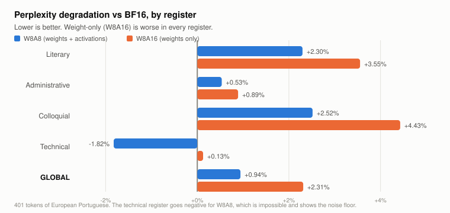
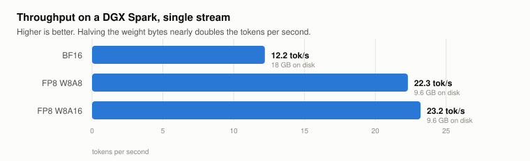

# FP8 on Blackwell: the "safer" quantization was twice as bad

**A quantization report with the failed hypotheses left in, because those were the useful part.**

I set out to make the first FP8 quantization of AMALIA-9B, the European Portuguese language
model, so it could be served on a GPU instead of only on Macs. Along the way I tested an
assumption I would have bet money on: that quantizing **only the weights** and leaving
activations in BF16 would be gentler than quantizing both.

It was twice as bad. And the config files prove the weights came out byte-identical in both
cases, which means the entire difference lives in the compute path, not in the numbers on
disk.

That is the finding. The rest of this document is how it was measured, how to reproduce it,
and the three other things I got wrong before getting there.

---

## TL;DR

| Variant | Size | Perplexity (PT-PT) | vs BF16 | Throughput |
|---|---|---|---|---|
| BF16 (reference) | 18 GB | 11.0987 | baseline | 12.2 tok/s |
| **FP8 W8A8** (weights + activations) | **9.6 GB** | **11.2033** | **+0.94%** | 22.3 tok/s |
| FP8 W8A16 (weights only) | 9.6 GB | 11.3553 | +2.31% | **23.2 tok/s** |

Hardware: NVIDIA DGX Spark, GB10 Grace-Blackwell, 121 GB unified memory, `sm_121a`,
CUDA 13, aarch64. Serving: vLLM 0.27.2rc1. Quantization: `llm-compressor`.

<picture>
  <source media="(prefers-color-scheme: dark)" srcset="charts/perplexity-dark.svg">
  
</picture>

Model: [CYBERS3C/AMALIA-9B-0626-DPO-FP8](https://huggingface.co/CYBERS3C/AMALIA-9B-0626-DPO-FP8),
quantized from [amalia-llm/AMALIA-9B-0626-DPO](https://huggingface.co/amalia-llm/AMALIA-9B-0626-DPO)
(Apache 2.0).

---

## 1. The main finding: the hardware knew better than I did

### 1.1 The hypothesis, which was a good one

Textbook reasoning: activations are the hard part of quantization. They change every token,
they have outliers, and stuffing them into 8 bits is where the damage happens. Weights are
static and well behaved, the reliable sibling of the pair.

Second premise: on a memory-bandwidth-bound accelerator, the speedup comes almost entirely
from reading fewer weight bytes per token, not from faster arithmetic. The GB10 reads at
roughly 273 GB/s and that number rules everything on this machine.

Put them together and weight-only quantization should keep nearly all the speed for a
fraction of the error. Elegant. Defensible. I would have published it as advice without
testing it, which is exactly the kind of confidence this repository exists to discourage.

### 1.2 The test

Two variants, one field apart.

```python
# W8A8, the standard dynamic FP8 recipe
QuantizationModifier(targets="Linear", scheme="FP8_DYNAMIC", ignore=["lm_head"])

# W8A16, weights only
scheme = QuantizationScheme(
    targets=["Linear"],
    weights=QuantizationArgs(
        num_bits=8, type=QuantizationType.FLOAT,
        strategy=QuantizationStrategy.CHANNEL, symmetric=True, dynamic=False,
    ),
    input_activations=None,     # <- the only difference
    output_activations=None,
)
QuantizationModifier(config_groups={"weights_fp8": scheme}, ignore=["lm_head"])
```

### 1.3 The result

| Variant | Perplexity | vs BF16 | Throughput |
|---|---|---|---|
| BF16 | 11.0987 | baseline | 12.2 tok/s |
| **W8A8** | **11.2033** | **+0.94%** | 22.3 tok/s |
| W8A16 | 11.3553 | +2.31% | **23.2 tok/s** |

Half the prediction survived contact with the data. W8A16 *is* marginally faster, which
confirms the bandwidth argument: the speed does come from the weights.

The error prediction was wrong by a factor of two, in the wrong direction, which is the
least useful way to be wrong.

### 1.4 Why

The config files `llm-compressor` wrote settle it:

```
W8A8    weights:     num_bits 8, type float, strategy channel, symmetric true
        activations: dynamic, strategy token, num_bits 8, type float

W8A16   weights:     num_bits 8, type float, strategy channel, symmetric true
        activations: null
```

**The weights are quantized identically.** Same bit width, same per-channel strategy, same
observer, same symmetry. One field differs, and it is the one about activations.

So the whole perplexity gap comes from the runtime path:

- **W8A8** dispatches to the Blackwell native FP8 tensor cores, which accumulate in FP32.
- **W8A16** upconverts the FP8 weights back to BF16 and runs the BF16 matmul path.

Put plainly: **on an accelerator with native FP8 support, using that support is more
accurate than politely declining it.** The conservative-looking option was the worse one.
There is probably a life lesson in there about trusting your hardware instead of protecting
it from itself, but I will stop at the numbers.

I did not instrument further to isolate the exact numerical mechanism. What is proven, with
the config files as evidence, is that the weight representation is identical and the
difference is in the kernel.

**If you are quantizing for Blackwell or Hopper, do not reach for weight-only FP8 because
it feels gentler. Measure it.**

---

## 2. The case study: AMALIA-9B

### 2.1 Why this model

AMALIA is *the* European Portuguese language model. That distinction matters more than it
sounds: European and Brazilian Portuguese diverge enough that a model trained mostly on the
latter is visibly foreign to the former. *Comboio* vs *trem*, *casa de banho* vs *banheiro*,
*telemóvel* vs *celular*, and the continuous aspect, *estou a fazer* against *estou fazendo*.
Portuguese readers notice within one sentence, roughly the way an English reader notices
"gotten" in a British contract.

At the time of the survey it existed in 85 repositories on the Hub. Fifteen GGUF for
llama.cpp. Fifteen MLX for Apple Silicon. Three ONNX, and those only for the speech models.

**Zero in FP8.** Zero in NVFP4, AWQ, GPTQ or compressed-tensors.

There are two bitsandbytes 4-bit repositories (`AMALIA-9B-0626-{DPO,SFT}-bnb`) which I
missed on the first pass and which forced a correction to this document. They are
`quant_type: fp4` with `compute_dtype: float32`, filed inside subdirectories that do not
load by repo id, with zero downloads each, and `bitsandbytes` is not among the quantization
methods the vLLM build used here supports.

The defensible statement: **no vLLM-servable quantization of AMALIA existed.**

*(Footnote added after publishing: the survey found 85 repositories and zero in FP8. There
are now 86, and one in FP8. The number this document argues from was changed by this
document, which feels like cheating but is at least honest cheating.)*

### 2.2 Why FP8 and not NVFP4

NVFP4 is the native 4-bit format on Blackwell and would have produced a tidy 5.5 GB
artifact. It was the wrong choice, for a reason you only notice when the model speaks one
particular language.

**NVFP4 requires calibration.** A few hundred text samples to compute scales. And the
default calibration datasets, in every pipeline, everywhere, are English.

So I was one command away from calibrating a European Portuguese model on English wikitext
and shipping a smaller, less Portuguese AMALIA. Which is the exact opposite of the point of
the entire exercise.

FP8 dynamic quantization computes weight scales per channel and activation scales at
runtime. **It needs no calibration data at all.** The risk disappears structurally rather
than through me being careful, and structural beats careful every single time.

| Format | Size | Expected loss | Calibration |
|---|---|---|---|
| BF16 | 18 GB | none | n/a |
| **FP8** | **9.6 GB** | negligible | **none** |
| NVFP4 | ~5.5 GB | real on a 9B | yes, and it would have to be in Portuguese |

### 2.3 Execution

```
load model in bf16:   ~107s
quantize:                2s
write to disk:         100s
TOTAL:                 209s
```

The two seconds are not a typo. `llm-compressor` notices the recipe needs no data and picks
a `DataFreePipeline`, which is a dignified name for "nothing to compute, just convert it".
Everything else is the disk earning its keep.

I admit to mild disappointment. You brace for a battle and it is over before you look up.

vLLM loads the result with no extra flags. It resolves `LlamaForCausalLM`, spots
`compressed-tensors`, and gets on with it.

| | BF16 | FP8 |
|---|---|---|
| Size on disk | 18 GB | **9.6 GB** |
| Startup | 270s | 180s |
| KV cache at `gpu-memory-utilization 0.35` | 140,912 tokens | **190,112 tokens** |
| Throughput, single stream | 12.2 tok/s | **22.3 tok/s** |

<picture>
  <source media="(prefers-color-scheme: dark)" srcset="charts/throughput-dark.svg">
  
</picture>

The 12.2 tok/s of the unquantized model deserves a moment, because it is the whole reason
this is worth doing. On a bandwidth-bound machine, reading 18 GB of weights per token is the
entire cost model. The consequence is that **a 9B model at BF16 runs slower than a
well-quantized 27B on the same hardware**, which offends everyone's intuition right up until
they do the division.

---

## 3. Methodology, mostly by way of what not to do

### 3.1 Exact-match agreement is the wrong metric

The obvious first test: same prompts, both variants, temperature 0, count identical answers.

**Result: 0 out of 12.** Common prefix agreement of 14.7%.

I had a bad few minutes.

The per-prompt data explains it. Two prompts diverge at **token 0**, another survives to
**token 21**. Greedy decoding is a snowball: one flipped logit changes a word and everything
downstream is different while being equally correct. Starting a sentence with "This" instead
of "The" is enough to destroy the entire metric.

**Exact-match agreement cannot measure quantization quality.** It can detect
non-determinism, which is the one honest day's work it did here.

### 3.2 Test the null hypothesis before believing bad news

Before blaming quantization, I ran the same evaluation twice against the **same** FP8 model.

**Result: 12/12 identical, 100% prefix agreement.** vLLM is deterministic at temperature 0
under these conditions, so the divergence from BF16 was real, even though it meant nothing.

Two minutes of work, and the difference between a finding and an embarrassment.

### 3.3 Perplexity is the right metric

Perplexity measures the model's confidence in the **same** tokens instead of the path it
would pick, so the snowball never starts.

Measured over 401 tokens across four registers of European Portuguese. The colloquial
passage was written deliberately stuffed with *comboio*, *pequeno-almoço*, *casa de banho*
and *telemóvel*, so that any drift across the Atlantic would show up somewhere specific
rather than as a vague feeling.

| Register | BF16 | W8A8 | W8A16 | Δ W8A8 | Δ W8A16 |
|---|---|---|---|---|---|
| Literary | 15.6962 | 16.0568 | 16.2540 | +2.30% | +3.55% |
| Administrative | 4.7820 | 4.8075 | 4.8246 | +0.53% | +0.89% |
| Colloquial | 9.8653 | 10.1136 | 10.3023 | +2.52% | +4.43% |
| Technical | 18.1637 | 17.8324 | 18.1867 | **-1.82%** | +0.13% |
| **Global** | **11.0987** | **11.2033** | **11.3553** | **+0.94%** | **+2.31%** |

Note the technical register, where the quantized model scores *better* than the original.
That is impossible, obviously. It is the numbers' way of reminding you they have off days
too, and it usefully calibrates how much per-text noise to expect. Only the global figure
gets a vote.

Implementation: vLLM's `/v1/completions` with `prompt_logprobs: 0` and `max_tokens: 1`, then
mean negative log-likelihood over the prompt tokens.

### 3.4 Language markers

Across 12 generation prompts, both variants produced 7 European Portuguese lexical markers
and **zero** Brazilian ones, using the European continuous construction throughout. The
model came out of surgery still Portuguese, which was the one thing that could not be
allowed to break.

---

## 4. Caveats

### 4.1 Statistical equivalence is not answer-by-answer equivalence

Sub-1% perplexity does not mean identical outputs. On one geography question:

> **BF16:** Madeira lies further south, west of Morocco *(correct)*
> **FP8:** Madeira lies further south, near the Strait of Gibraltar *(off by about 700 km)*

The quantized model relocated an island, which is a lot of geopolitical ambition for a
0.94% difference.

One case in twelve, and quite possibly greedy-path luck rather than systematic damage. But
it is worth saying out loud: a model within 1% perplexity still produces individually
different answers, occasionally worse ones. For text generation this is almost always fine.
For factual claims heading to an end user, it wants verification on top, quantized or not.

### 4.2 Scope

One model, one architecture (`LlamaForCausalLM`), one hardware target, one language. The
W8A8 vs W8A16 result is the part most likely to generalise, since it is a property of kernel
dispatch rather than of this model, but it has not been tested elsewhere. If you reproduce
it on other hardware, I would genuinely like to know, including if it does not hold.

### 4.3 The claim I got wrong

The first draft asserted that no GPU quantization of AMALIA existed. False, as described in
2.1, and caught by a validation pass rather than by a reviewer, which is the good outcome of
the two available.

Where the error was is the interesting bit. Every numeric claim had been checked
programmatically against the raw files: 29 assertions, zero failures, considerable smugness.
The headline sentence, the one everybody actually reads, had been checked once, with a
search that used the wrong limit.

**The most prominent claim tends to be the least verified.** It is a load-bearing sentence
resting on a single unrepeated search, and it is always the one that ends up in the
screenshot.

---

## 5. Reproduction

### 5.1 Quantize

Inside the vLLM container, with `llmcompressor` installed:

```bash
python3 scripts/quantize_fp8.py                  # W8A8, the one you want
python3 scripts/quantize_fp8_weights_only.py     # W8A16, kept so it can be challenged
```

### 5.2 Serve

```bash
vllm serve CYBERS3C/AMALIA-9B-0626-DPO-FP8 \
  --served-model-name amalia \
  --max-model-len 32768 \
  --host 0.0.0.0 --port 8000
```

### 5.3 Evaluate

```bash
# generation quality and dialect markers
TEST_URL=http://host:8000/v1/chat/completions OUTPUT=results/fp8.json \
  python3 scripts/evaluate.py

# perplexity, the metric that actually answers the question
TEST_URL=http://host:8000/v1/completions OUTPUT=results/ppl_fp8.json \
  python3 scripts/perplexity.py

# compare against the BF16 reference
python3 scripts/compare.py results/bf16.json results/fp8.json

# check every number in this README against the raw files
python3 scripts/validate.py
```

`validate.py` is the one to run before you publish anything. It exists because of section 4.3.

### 5.4 Practical notes, learned the tedious way

- `llm-compressor` writes a single `model.safetensors`. Above 5 GB the Hub convention is to
  shard. `scripts/reshard.py` re-shards without touching tensor data, verified byte for byte
  against a backup and by re-measuring perplexity, which came out identical to four decimal
  places.
- `special_tokens_map.json` is not written by `save_pretrained` in this version. It is
  redundant, tokenization was verified identical without it, but it was copied from the
  original anyway so nobody has to wonder.
- On unified-memory machines, count **every** memory consumer before setting
  `gpu-memory-utilization`. A forgotten systemd service holding 18 GB caused an OOM that took
  a 121 GB machine down for 20 hours. `docker ps` is not enough, and the service was hiding
  in plain sight, which is where things hide best.
- vLLM will not share the CUDA memory pool. A second inference process cannot join the party
  without lowering `gpu-memory-utilization` and restarting first, no matter how much system
  RAM appears to be free.
- `cp -a source dest` copies *into* dest when dest already exists. The resharding script
  deletes the original when it finishes. Those two facts are fine separately.

---

## 6. Attribution

The model is the work of the AMALIA team:
[amalia-llm/AMALIA-9B-0626-DPO](https://huggingface.co/amalia-llm/AMALIA-9B-0626-DPO),
Apache 2.0. This repository contributes a quantization and nothing else. All the hard part
was already done.

Quantization with [llm-compressor](https://github.com/vllm-project/llm-compressor).
Serving with [vLLM](https://github.com/vllm-project/vllm).

---

Written in Portugal, with love.
